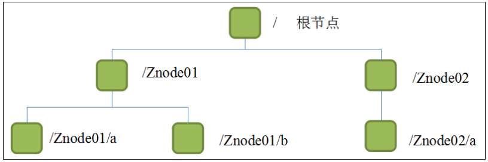
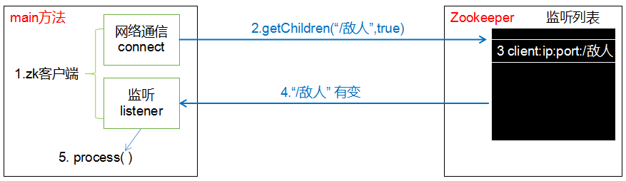
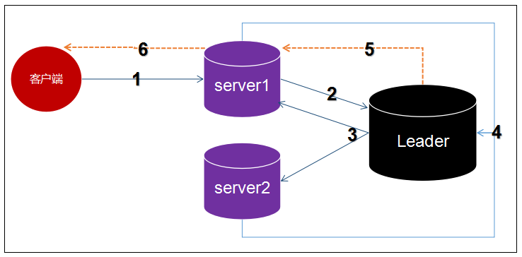
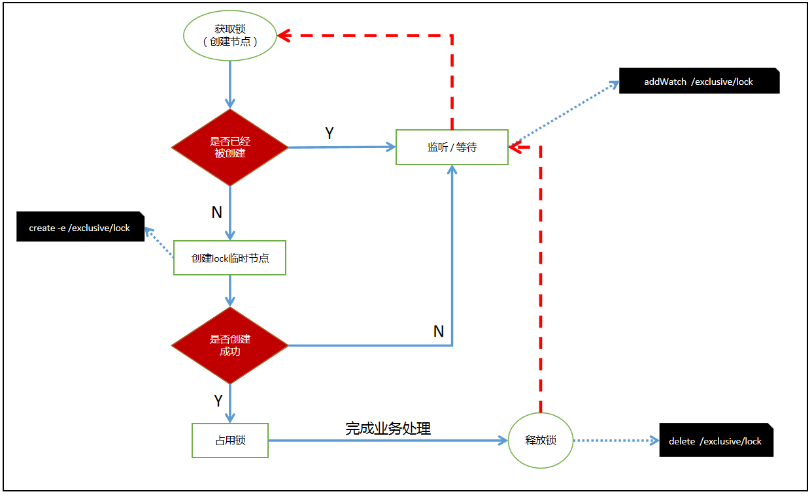
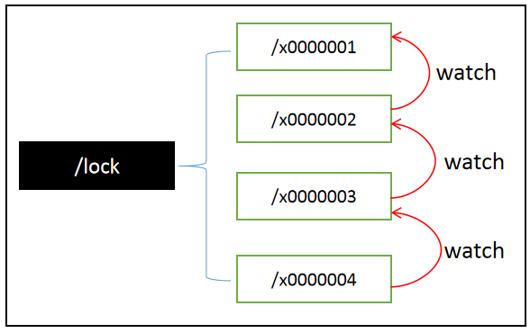
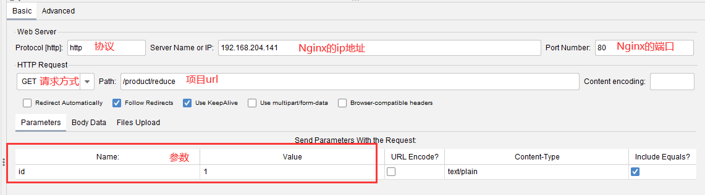
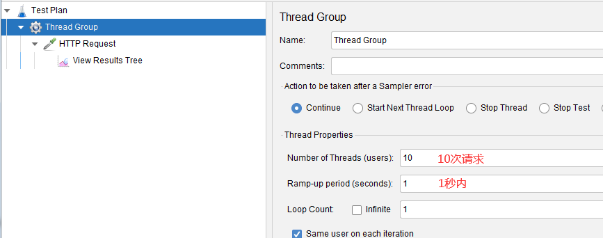
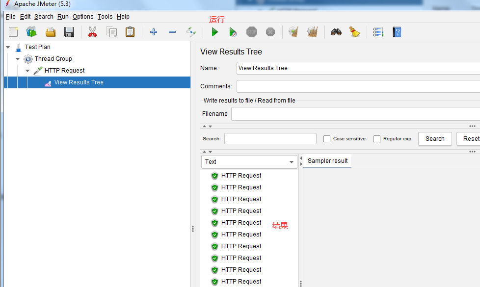

# Zookeeper

# 1.Zookeeper概述

## 1.1 概述

Zookeeper是一个开源的分布式（多台服务器干一件事）的，为分布式应用提供**协调服务**的Apache项目。

## 1.2 工作机制

* 设计模式：观察者模式
* 它负责**存储**和**管理**数据
* Zookeeper = 文件系统 + 通知机制
  
## 1.3 特点

* 分布式和集群的区别
  * 分布式：各个服务器分别负责的不同的工作
  * 集群：各个服务器负责相同的工作

1. 一个leader和多个follower组成集群
2. 集群中只要有半数以上的节点存活，Zookeeper就能正常工作
3. 全局数据一致性，每台服务器都保存一份相同的数据副本，无论client连接哪台server，数据都是一致的
4. 数据更新原子性
5. 实时性，在一定时间范围内，client能读取到最新数据
6. 更新的请求按照顺序执行，按照发过来的顺序执行

## 1.4 数据结构



* Zookeeper数据模型的结构与Linux文件系统类似，整体可看作是一棵数，每个节点称作ZNode（ZookeeperNode）
* 每个ZNode默认存储1MB元数据，每个ZNode路径都是唯一的
   
## 1.5 应用场景
    统一命名服务器
    统一配置管理
    服务节点动态上下线
    软负载均衡

# 2. Zookeeper本地模式安装

## 2.1 本地模式安装

```
```

## 2.2 配置参数

默认配置文件名：zoo.cfg

[zoo_sample.cfg](zoo_sample.cfg)

```
# 修改和创建数据和日志目录
dataDir=/tmp/zookeeper/zkData
dataLogDir=/tmp/zookeeper/zkLog
```

# 3. Zookeeper内部原理

## 3.1 选举机制

* 半数机制：集群中半数以上的机器存活，集群可用。（Zookeeper适合奇数台服务器）

## 3.2 节点类型

* 持久型
  * 持久化目录节点
  * 持久化顺序编号目录节点

* 短暂型
  * 临时目录节点：客户端可服务端断开连接后，创建的节点自动删除
  * 临时顺序编号目录节点

## 3.3 监听器原理



## 3.4 写数据流程
 



# 4. Zookeeper实战
## 4.1 分布式安装部署
集群思路：先配置一台服务器，再克隆出两台，形成集群

### 4.1.1 安装Zookeeper

### 4.1.2 配置服务器编号

zkData目录下新建文本文件myid添加服务器编号

### 4.1.3 配置zoo.cfg

```
### cluster ###
server.1=ip1:2888:3888
server.2=ip2:2888:3888
server.3=ip3:2888:3888
```

* 配置参数：server.A=B:C:D
  * A：服务器编号，zookeeper/zkData/myid中的值
  * B：服务器ip
  * C：与集群中Leader服务器交换信息的端口
  * D：选举时专用端口


```shell
# 关闭防火墙
systemctl stop firewalld.service
```

# zkCli
## zookeeper help
```shell

[zk: localhost:2181(CONNECTED) 0] help
ZooKeeper -server host:port -client-configuration properties-file cmd args
	addWatch [-m mode] path # optional mode is one of [PERSISTENT, PERSISTENT_RECURSIVE] - default is PERSISTENT_RECURSIVE
	addauth scheme auth
	close 
	config [-c] [-w] [-s]
	connect host:port
	create [-s] [-e] [-c] [-t ttl] path [data] [acl]
	delete [-v version] path
	deleteall path [-b batch size]
	delquota [-n|-b|-N|-B] path
	get [-s] [-w] path
	getAcl [-s] path
	getAllChildrenNumber path
	getEphemerals path
	history 
	listquota path
	ls [-s] [-w] [-R] path
	printwatches on|off
	quit 
	reconfig [-s] [-v version] [[-file path] | [-members serverID=host:port1:port2;port3[,...]*]] | [-add serverId=host:port1:port2;port3[,...]]* [-remove serverId[,...]*]
	redo cmdno
	removewatches path [-c|-d|-a] [-l]
	set [-s] [-v version] path data
	setAcl [-s] [-v version] [-R] path acl
	setquota -n|-b|-N|-B val path
	stat [-w] path
	sync path
	version 
	whoami 
Command not found: Command not found help

```

## 查看当前节点详细数据：ls -s / 

| 属性                                   | 说明                             |
|--------------------------------------|--------------------------------|
| cZxid = 0x0                          | 创建节点的事务                        |
| ctime = Thu Jan 01 08:00:00 CST 1970 | 创建时间                           |
| mZxid = 0x0                          | 最后更新的事务zxid                    |
| mtime = Thu Jan 01 08:00:00 CST 1970 | 最后修改的时间                        |
| pZxid = 0x0                          | 最后更新的子节点zxid                   |
| cversion = -1                        | 创建版本号，子节点修改次数                  |
| dataVersion = 0                      | 数据变化版本好                        |
| aclVersion = 0                       | 权限版本号                          |
| ephemeralOwner = 0x0                 | 临时节点，为znode拥有者的session id，否则为0 |
| dataLength = 0                       | 数据长度                           |
| numChildren = 1                      | 子节点个数                          |

## 创建节点：create /China
## 创建短暂节点（退出（quit）客户端 ，该节点消失）：create -e /UK
## 创建顺序节点：create -s /Ru/city
```
Created /Ru/city0000000000

 ls /Ru
[city0000000000, city0000000001, city0000000002]
```
## 修改节点值：set /China "中国"
## 监听节点值的变化和自建的变化（路径变化）：addWatch /China 
```
# set /China "中国"

WATCHER::

WatchedEvent state:SyncConnected type:NodeDataChanged path:/China

# create /China/HeNan

WATCHER::

WatchedEvent state:SyncConnected type:NodeCreated path:/China/HeNan
```
## 删除（无子节点的）节点：delete /China/HeNan
## 递归删除节点：deleteall /China/HeNan

## 4.4 案例-分布式锁-商品秒杀


* 锁：在多线程中，锁的作用是让当前资源不会被其他线程访问。
* zookeeper中使用传统的锁引发的“羊群效应”：1000个人创建节点，只有一个能成功，999个人需要等待。
  * 避免“羊群效应”，zookeeper采用分布式锁。
  
    1. 所有请求进来，在/lock下创建**临时顺序节点**。
    2. 判断自己是不是/lock下**最小的节点**：
       1. 是：获得锁（创建节点）
       2. 否，对前面小我一级的节点进行监听
    3. 获得锁请求，处理完业务逻辑，释放锁（删除节点），后一个节点得到通知（比你年轻的死了，你是最小的）
    4. 重复步骤2
  
### 实现步骤
#### 1. 初始化数据库

```
# 创建数据库zkproduct，使用默认的字符集
CREATE DATABASE `zkproduct` /*!40100 DEFAULT CHARACTER SET utf8 */

-- 商品表
create table product(
  id int primary key auto_increment, -- 商品编号
  product_name varchar(20) not null, -- 商品名称
  stock int not null, -- 库存
  version int not null -- 版本
)

insert into product (product_name,stock,version) values('锦鲤-清空购物车-大奖',5,0)

-- 订单表
create table `order`(
  id varchar(100) primary key, -- 订单编号
  pid int not null, -- 商品编号
  userid int not null -- 用户编号
)
```

#### 2. 搭建工程

#### 3. 启动测试

##### nginx + jmeter并发测试

nginx配置
```
    upstream zk_product{
        server 192.168.1.111:8001;
        server 192.168.1.111:8002;
    }

    server {
        location / {
            proxy_pass http://zk_product;
        }
    }
```





#### 4. apache提供的zookeeper客户端
基于zookeeper原生态的客户端实现分布式是非常麻烦的，使用apache提供了一个zookeeper客户端Curator来实现
```xml
        <dependency>
            <groupId>org.apache.curator</groupId>
            <artifactId>curator-recipes</artifactId>
            <version>4.2.0</version>
        </dependency>
```


# NOTES
# 服务器搭建zookeeper集群

```
# zoo.cfg需要添加下面这行，解决ip和端口绑定问题
quorumListenOnAllIPs=true
```
https://blog.csdn.net/u014284000/article/details/74508963